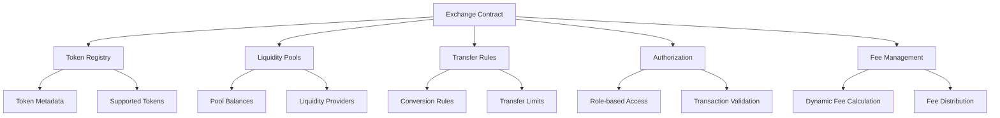

# Gwei Process: Cross-Chain Token Exchange Protocol

A decentralized infrastructure for seamless token transfers and cross-chain liquidity management, providing robust, secure, and flexible asset exchange mechanisms.

## Overview

Gwei Process enables blockchain developers and users to create sophisticated cross-chain token transfer and exchange strategies with comprehensive security and routing capabilities. The platform offers:

- Decentralized token exchange infrastructure
- Cross-chain transaction routing
- Liquidity pool management
- Dynamic fee calculation
- Advanced authorization mechanisms
- Flexible token conversion rules

## Architecture

Gwei Process is built around a central exchange contract that manages token transfers, conversions, and cross-chain interactions.



The system uses several key data structures:
- Token Registry: Manages supported tokens and their metadata
- Liquidity Pools: Tracks token balances and provider stakes
- Transfer Rules: Defines cross-chain conversion mechanisms
- Authorization: Implements secure access control
- Fee Management: Calculates and distributes transaction fees

## Contract Documentation

### gwei-exchange.clar

This is the core contract managing cross-chain token exchanges and transfers.

#### Key Functions

**Token Management:**
- `register-token`: Add new supported tokens
- `update-token`: Modify token metadata
- `get-token`: Retrieve token information

**Liquidity Pool Operations:**
- `create-liquidity-pool`: Initialize a new token pool
- `add-liquidity`: Stake tokens in a pool
- `remove-liquidity`: Withdraw tokens from a pool
- `calculate-pool-share`: Determine provider's stake

**Transfer Mechanisms:**
- `initiate-cross-chain-transfer`: Start a token transfer
- `validate-transfer-rules`: Check transfer eligibility
- `execute-token-conversion`: Convert tokens between chains

**Authorization:**
- `set-transfer-limits`: Configure transfer restrictions
- `manage-access-roles`: Control contract interactions
- `validate-transaction`: Verify transfer permissions

## Getting Started

### Prerequisites
- Clarinet
- Stacks wallet
- Basic understanding of cross-chain protocols

### Installation

1. Clone the repository
2. Install dependencies
```bash
clarinet install
```
3. Test the contracts
```bash
clarinet test
```

### Basic Usage

1. Register a token:
```clarity
(contract-call? .gwei-exchange register-token 
    "STX" 
    "Stacks Token" 
    u8 
    true)
```

2. Create a liquidity pool:
```clarity
(contract-call? .gwei-exchange create-liquidity-pool
    "STX"
    "USDC"
    u1000000)  ;; Initial pool size
```

3. Initiate a cross-chain transfer:
```clarity
(contract-call? .gwei-exchange initiate-cross-chain-transfer
    "STX"
    "USDC"
    u500
    "target-chain-address")
```

## Development

### Testing

Run the test suite:
```bash
clarinet test
```

### Local Development

1. Start Clarinet console:
```bash
clarinet console
```

2. Deploy contracts:
```bash
clarinet deploy
```

## Security Considerations

### Permissions
- Strict role-based access control
- Multi-signature transaction validation
- Comprehensive transfer rule enforcement

### Limitations
- Maximum transfer limits per transaction
- Supported token validation
- Dynamic fee calculations

### Best Practices
- Implement comprehensive input validation
- Use deterministic fee calculation
- Regularly update transfer rules
- Conduct thorough security audits